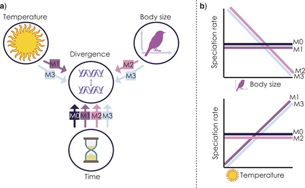
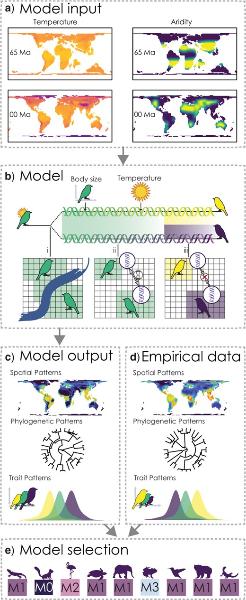



```{r setup, include=FALSE}
knitr::opts_chunk$set(warning = FALSE, message = FALSE) 
```

## Exploring outputs {.unnumbered}

In this practical we will explore the outputs from gen3sis using the island simulations we ran yesterday. We will learn how to use this data with common R packages for phylogenetic comparative methods, community phylogenetics, biogeography and much more.

The goal for today will be to produce:

1.  A map of Species Richness from the simulation summary object

2.  A plot of Lineages Through Time from the phylogeny

3.  Plot of species trait values on a phylogenetic tree, by linking the species objects to the phylogeny

4.  Maps of Phylogenetic Diversity by linking species objects to the landscape and phylogeny

First, let's make sure we have the necessary packages loaded

#### Simulation summary object (sgen3sis.rds) {.unnumbered}

The first object we will look at today is the sgenesis.rds file. This file contains a summary of the simulation. Which we can plot (as we did yesterday) with the plot_summary function. This is the same object, that you would have in memory by running a simulation with run_simulation.

```{r}
# path to the simulation output folder used throughout this practical
config_dir <- here::here("output", "islands", "config_islands_simple_Day1Prac3_M1")

# load the simulation summary object produced by gen3sis
sim <- readRDS(file.path(config_dir, "sgen3sis.rds"))

# look at what the simulation summary contains
names(sim)
```

The first element is the sim summary. This contains a record of the history of speciation, extinction, and species richness through time (phylo_summary), a history of the number of total grid cells occupied during the simulation through time (occupancy) and the species richness of each grid cell at the final time step.

```{r}
str(sim$summary)

# phylo summary
head(sim$summary$phylo_summary)

# occupancy
head(sim$summary$occupancy)

# occupancy
head(sim$summary$`richness-final`)
```

These data can be visualized with the plot_summary function

```{r}
# Visualize the outputs 
plot_summary(sim)
```

We can also use these data to map out patterns of species richness

```{r}
# make sure the landscape is loaded
lc <- readRDS(here::here("data", "landscapes", "islands", "landscapes.rds"))

# can remove cells with elevation below sea level at timestep 0 (present-day) to see the outlines of the islands
na_mask <- is.na(lc$elevation[,"0"])
rich <- sim$summary$`richness-final`
rich[na_mask,3] <- NA

# turn the summary table of x, y, richness values into a raster
richness <- rast(rich, type="xyz")

# plot, the sea is darblue, given by hexadecimal color code 
plot(richness, col=c("grey", gen3sis::color_richness(12)), colNA="#000033")
```

The next part of the simulation summary object is the flag which will tell us if the simulation ran successfully. It should give "OK"

```{r}
sim$flag
```

Next is the system summary. This is information about the R version, R packages, and operating system used in the simulation. This ensures complete repeatability. It also tells us the runtime of the simulation.

```{r}
names(sim$system)
sim$system[1:2]
```

Finally the summary object contains the config information and model parameters used.

```{r}
names(sim$parameters)
names(sim$parameters$gen3sis)
```

#### Phylogeny object (phy.nex) {.unnumbered}

The phylogeny object is pretty straight forward. It is a nexus file containing the relationships between the species.

```{r}
# read phy
phy <- read.nexus(file.path(config_dir, "phy.nex"))

# quick tree plot; axisPhylo adds time/depth along the x-axis
plot(phy, cex=0.4)
axisPhylo()
```

From this object we can look at lineages through time plots and estimate trends in diversification. The gamma statistic is one way to detect diversification slowdowns or speedups, with positive values indicating nodes are more closely pushed up towards the tips (speed up) and negative values indicating nodes are closer to the root (slowdown) ([Pybus and Harvey 2000](https://royalsocietypublishing.org/doi/10.1098/rspb.2000.1278)). There are lots of other kinds of measures of phylogenetic tree shape, such as metrics of tree imbalance (Colless's Index, Beta-Splitting Paramater, etc.)

```{r}
# ltt() both plots the lineage-through-time curve and returns summary statistics
ltt_M1 <-ltt(phy)

# look at the gamma statistic
print(paste0("Gamma = ", round(ltt_M1$gamma, 2)))

# is there a significant deviation from constant rates?
print(paste0("P = ", round(ltt_M1$p, 2)))
```

#### Species objects (phy.nex) {.unnumbered}

Now its time to get into the meat of the gen3sis outputs. Most of the information from the simulation is stored in the species objects. These are .rds files that contain a list which includes information on every species, extinct or extant, that existed during the simulation. These are saved per default at every time step, but can be fine tuned according to your needs. The naming convention is "species_t_0.rds" for time step 0 (present-day), and "species_t_50" for timestep 50, etc.

```{r}
# load object
species_t_0 <- readRDS(file.path(config_dir, "species", "species_t_0.rds"))

# look at object class and length
class(species_t_0)
length(species_t_0)

# compare to number of tips in the phylogeny
Ntip(phy)
```

There are 14 elements in the list, representing our 14 species and this number matches the number of species in our phylogeny. No species went extinct in this particular simulation, but if they did, they would match extinct tips in the phylogeny.

Lets look at a single species

```{r}
names(species_t_0[[1]])


```

The species has an ID which allows us to match it to the phylogeny.

```{r}
species_t_0[[1]]$id
```

The species' abundances are also linked to grid cells in the landscape, which can be matched with their corresponding names.

```{r}
species_t_0[[1]]$abundance
```

In this case the species has abundance values of 1 in all populations from the cells that it occupies. This is because we set abundances to be binary: 1=present, 0=absent. We can see the species occupies cells 247, 248, 249, etc.

The species also has values of it's traits for each of its populations.

```{r}
head(species_t_0[[1]]$traits)
```

We can see the population that each row is linked by the rownames. Here you can see 247, 248, 249, etc. Each of these populations have a dispersal trait of 5 (because we didn't vary this) slightly different temp_mean traits (because these evolved stochastically under a Brownian motion model) and a temp width of 1 (again, we didn;t vary this in model 1).

So, if we want to map out the distribution of species 1 at timestep 0, we just need to link those cell names (267/268/etc) to the landscape object and make a raster. Why don;t we try and see what islands species 1 is found on.

```{r}
par(mfrow=c(1,3))

# first plot the islands out from the landscape object
patch_xyz <- rast(lc$patch[,c("x", "y", "0")], type="xyz")
plot(patch_xyz, main="Island Patches", col=palette()[c(2,3,4,6)], colNA="#000033")

# match occupied cell IDs from the species traits table back to landscape coordinates
species1_xyz <- lc$patch[which(rownames(lc$patch) %in% rownames(species_t_0[[1]]$traits)), c("x", "y", "0")]

# convert those occupied cells to a raster and extend to the full island extent for plotting
species1_xyz <- rast(species1_xyz, type="xyz")
species1_xyz <- extend(species1_xyz, patch_xyz)
plot(species1_xyz, main= "Species 1 Distribution", colNA="#000033")

# alternatively we can use the plot_species function on gen3sis..
# for that we load the landscape object of the respective time-step
landscape_t_0 <- readRDS(file.path(config_dir, "landscapes", "landscape_t_0.rds"))
gen3sis::plot_species_presence(species_t_0[[1]], landscape_t_0)

```

#### Linking the species object and phylogeny {.unnumbered}

Lets try and link the species trait data to the phylogeny to start learning something about what exactly took place during our simulation! Let's get the mean trait value of the temperature niche and also the islands that each species belongs too.

```{r}
# build a species-level table that we can join to the phylogeny
daf <- data.frame("id"= paste0("species",sapply(species_t_0, function(x)x$id)),
                 "mean_temp"=NA,
                 "island1"=0,
                 "island2"=0,
                 "island3"=0,
                 "island4"=0, 
                 "island_start"=NA)

# take a look
head(daf)

# Use sapply on the species object to get their mean trait values
daf$mean_temp <- sapply(species_t_0, function(x){
  # average the temperature niche centre across all populations of each species
  mean(x$traits[, "temp_niche_centre"], na.rm=T)
  })

# Get the island patch id values in a for loop
for(i in 1:length(species_t_0)){
  # useful debugging shortcut:
  # i <- 1 

  # recover the island patch IDs occupied by this species
  speciesi_xyz <- lc$patch[which(rownames(lc$patch) %in% rownames(species_t_0[[i]]$traits)), c("x", "y", "0")]
  
  # then pull out the unique values (note that species might occur on more than one island)
  islands <- unique(speciesi_xyz[, 3])
  
  # store simple presence/absence indicators for each island
  daf$island1[i] <- ifelse(1 %in% islands, 1, 0)
  daf$island2[i] <- ifelse(2 %in% islands, 1, 0)
  daf$island3[i] <- ifelse(3 %in% islands, 1, 0)
  daf$island4[i] <- ifelse(4 %in% islands, 1, 0)
}

# get the starting island from the traits object since we recorded this in the initialization step
daf$island_start <- sapply(species_t_0, function(xasa) unique(xasa$traits[, "start_island"]))
```

Now look again at the data frame

```{r}
head(daf)
```

Plot out the continuously evolving temperature niche trait

```{r}

# create a named trait vector so tip labels can be matched automatically
temp_niche <- daf$mean_temp
names(temp_niche) <- daf$id

# plot it out with dots = trait
dotTree(phy,temp_niche,ftype="i", length=8, fsize=1.2, standardize=T)
```

Not much variation in that trait, due to the combined effects of trait homogenization and a low rate of change. Lets plot the tip states of the islands on the phylogeny using the phytools package

```{r}
par(mfrow=c(1,2))

# helper to convert an island membership column into the matrix format expected by tiplabels()
formatIsland <- function(island, phy=phy, daf=daf){
  islandf <- as.factor(daf[, island])
  names(islandf) <- daf$id

  # reorder rows so the island states line up with the phylogeny tip order
  islandmat<-to.matrix(islandf,levels(islandf))
  islandmat<-islandmat[phy$tip.label,]
  return(list(islandf, islandmat))
}

# first panel: tree with pie symbols showing present-day island occupancy
plotTree(phy,ftype="i",offset=1,fsize=0.9, xlim=c(0, 75))

tiplabels(pie=formatIsland(island="island1", phy=phy, daf=daf)[[2]],piecol=palette()[c(8,2)],cex=0.6, adj=12+1)
tiplabels(pie=formatIsland(island="island2", phy=phy, daf=daf)[[2]],piecol=palette()[c(8,3)],cex=0.6, adj=12+3)
tiplabels(pie=formatIsland(island="island3", phy=phy, daf=daf)[[2]],piecol=palette()[c(8,4)],cex=0.6, adj=12+5)
tiplabels(pie=formatIsland(island="island4", phy=phy, daf=daf)[[2]],piecol=palette()[c(8,6)],cex=0.6, adj=12+7)

plot(patch_xyz, main="Island Patches", col=palette()[c(2,3,4,6)])
```

Interesting. What do you notice about the distribution of species on islands? Could you predict which island each lineage began on?

We actually know which islands each lineage started on because we recorded this as a trait (we could also look at the past species objects to figure this out but we have used a shortcut though the traits).

```{r}

par(mfrow=c(1,2))

# second comparison: starting island first, then present-day occupancy columns
plotTree(phy,ftype="i",offset=1,fsize=0.4, xlim=c(0, 75))
my_cex=0.9
# add the starting island as the first colum
tiplabels(pie=formatIsland(island="island_start", phy=phy, daf=daf)[[2]],piecol=palette()[c(2,3,4,6)],cex=my_cex*3, adj=12)

tiplabels(pie=formatIsland(island="island1", phy=phy, daf=daf)[[2]],piecol=palette()[c(8,2)],cex=my_cex, adj=12+1)
tiplabels(pie=formatIsland(island="island2", phy=phy, daf=daf)[[2]],piecol=palette()[c(8,3)],cex=my_cex, adj=12+3)
tiplabels(pie=formatIsland(island="island3", phy=phy, daf=daf)[[2]],piecol=palette()[c(8,4)],cex=my_cex, adj=12+5)
tiplabels(pie=formatIsland(island="island4", phy=phy, daf=daf)[[2]],piecol=palette()[c(8,6)],cex=my_cex, adj=12+7)

# add island plot
plot(patch_xyz, main="Island Patches", col=palette()[c(2,3,4,6)])
```

So whats really apparent here is that the clade that originated on the green island has speciated allopatrically into the red island multiple times in the recent past. The same is true for the red clade, however the deeper divergence between species9 and species3 have had enough time to recolonize both islands.

#### Linking the species object, landscape, and phylogeny

Common spatial biodiversity analyses link information measured at the species level to maps of their distribution in space using presence-absence matrices or PAMs. PAMs typically are data frame with each row representing a site, could be an island or could be a grid cell, and each column representing a species. Values of 1 are given if the species is present in the site, if not a value of 0 is given.

```{r}
# grid cell level PAM

# define site IDs from landscape row names (fallback to row indices if missing)
site_ids <- rownames(lc$elevation)
if (is.null(site_ids)) {
  site_ids <- as.character(seq_len(nrow(lc$elevation)))
}

# create an empty site-by-species presence-absence matrix
PAM <- matrix(
  0L,
  nrow = length(site_ids),
  ncol = length(species_t_0),
  dimnames = list(site_ids, paste0("species", sapply(species_t_0, function(x) x$id)))
)

# fill the matrix with presences by matching occupied cell IDs to rows
for (i in seq_along(species_t_0)) {
  present_sites <- names(species_t_0[[i]]$abundance)

  # if abundance names are unavailable, use trait row names as occupied cell IDs
  if (is.null(present_sites) || length(present_sites) == 0) {
    present_sites <- rownames(species_t_0[[i]]$traits)
  }

  present_sites <- intersect(site_ids, as.character(present_sites))
  if (length(present_sites) > 0) {
    PAM[present_sites, i] <- 1L
  }
}

PAM <- as.data.frame(PAM, check.names = FALSE)

# how does it look? show first occupied cells so the preview includes presences
occupied_rows <- which(rowSums(PAM) > 0)
print(PAM[head(occupied_rows, 10), seq_len(min(10, ncol(PAM)))])
```

```{r}
# these functions treat PAM rows as sites and columns as species
# PD = total branch length represented in a site
pd_islands <- pd(PAM, phy)

# MPD and MNTD summarize how related co-occurring species are
mpd_islands <- mpd(PAM, cophenetic(phy))
mntd_islands <- mntd(PAM,cophenetic(phy))

# join the community metrics back to x/y coordinates for mapping
community_phylo <- cbind(lc$elevation[, c("x", "y")], pd_islands, mpd_islands, mntd_islands)

par(mfrow=c(2,2))

# build one raster per metric from the x/y/value columns
sr_ras <- rast(community_phylo[, c("x", "y", "SR")], type="xyz")
pd_ras <- rast(community_phylo[, c("x", "y", "PD")], type="xyz")
mpd_ras <- rast(community_phylo[, c("x", "y", "mpd_islands")], type="xyz")
mntd_ras <- rast(community_phylo[, c("x", "y", "mntd_islands")], type="xyz")

plot(sr_ras, main="Species Richness", colNA ="red")
plot(pd_ras, main="Phylogenetic Diversity")
plot(mpd_ras, main="Mean Phylogenetic Pairwise Distance")
plot(mntd_ras, main= "Mean Nearest Neighbour Phylogenetic Distance")
```

## Sensitivity analysis {.unnumbered}

In this part we are going to load in a data set from Skeels et al. (2022) *SystBiol* in which we simulated data with Gen3sis under four alternative models to test the evolutionary speed hypothesis (ESH). The ESH hypothesizes that faster rates of evolution occurs in lineages from warm regions like the tropics because they are have higher mutagenesis from faster life histories associated with warm temperatures and smaller body sizes. The four models used there were

-   M0 - the null. population divergence is independent of temperature and body size

-   M1 - Temperature Trailblazer. environmental temperature drives rate of population divergence

-   M2 - Size Shaper. body size drives the rate of population divergence

-   M3 - Synergistic Drivers. environmental temperature and body size drives the rate of population divergence



Not only did we change the overall model of evolution, we also varied key parameters for rates of niche evolution (simga_squared_t), rates of body size evolution (sigma_squared_bs), dispersal, and the temperature niche breadth (omega), the exponent of the divergence factor with temp/body size (lambda), and the divergence threshold. Load in the data and take a look, the first 6 columns are the model parameters we varied.

```{r}
# each row is one simulation replicate; the first six columns are input parameters
sim_data <- read.csv(here::here("data", "simulated_summary_statistics.csv"))

# look at the first few columns
head(sim_data)

# look at the models
unique(sim_data$m)
```

This data set has 27 metrics used in our paper to measure patterns in the distribution of species, such as range size metrics, or correlations between temperature and diversity, as well as phylogenetic tree shape metrics, such as gamma, and measures of functional diversity, like body size variance. We predicted that these different models of evolution (M0-M4) should leave discernible signatures in these metrics. We can plot a few associations between biodiversity metrics and these model parameters to test this hypothesis.

```{r}
# how is diversity related to the dispersal ability of a clade?
ggplot(sim_data, aes(x=m, y=log(n_extant_diversity), fill=m))+
  geom_point(alpha=0.7, position = "jitter")+
  geom_boxplot(alpha=0.7)+
  stat_smooth()+
  theme_classic()

# how about the temperature~diversity gradient?
ggplot(sim_data, aes(x=m, y=richness_temp0mya_cor, fill=m))+
  geom_point(alpha=0.7, position = "jitter")+
  geom_boxplot(alpha=0.7)+
  stat_smooth()+
  theme_classic()

# how about the relationship between  body size and diversification rate?
ggplot(sim_data, aes(x=m, y=bodysize_DR_cor, fill=m))+
  geom_point(alpha=0.7, position = "jitter")+
  geom_boxplot(alpha=0.7)+
  stat_smooth()+
  theme_classic()

# how about the relationship between temperature and diversification rate?
ggplot(sim_data, aes(x=m, y=temp_DR_cor, fill=m))+
  geom_point(alpha=0.7, position = "jitter")+
  geom_boxplot(alpha=0.7)+
  stat_smooth()+
  theme_classic()
```

::: {style="background-color: lightgreen; padding: 1px;"}
❓ **Question** \[max 5 min\] Do these patterns fit our predictions? Which model effects look strongest, and which metrics seem least informative?

<details>

Think of this section in two steps:

1) Which model parameters influence biodiversity metrics?

2) Which metrics are weakly explained and likely need nonlinear models/interactions?

From the scatter/boxplot views, some associations are visible, but the strength differs by metric. In general, some metrics show clearer model separation than others. This is expected in eco-evolutionary simulations because multiple processes can produce similar emergent patterns.

Useful interpretation template:

- Stronger-looking effects: metrics with clearer separation among models and tighter within-model spread.
- Weaker/less informative effects: metrics with substantial overlap among models and high dispersion.
- Key caveat: visual trends are helpful, but formal models (below) are needed to quantify effect size and uncertainty.

</details>
:::

We can also look at how some of these metrics varied with the continuous model parameters such as dispersal ability.

```{r}
# how is diversity related to the dispersal ability of a clade?
ggplot(sim_data, aes(x=dispersal, y=log(n_extant_diversity)))+
  geom_point(alpha=0.7)+
  stat_smooth()+
  theme_classic()

# how about the latitude diversity gradient?
ggplot(sim_data, aes(x=dispersal, y=temp_DR_cor))+
  geom_point(alpha=0.7)+
  stat_smooth()+
  theme_classic()
```

To perform a simple kind of sensitivity test we might ask how each of the model parameters predicts linear changes in the distribution of a biodiversity patterns using a multiple regression model. One example where we have a good idea of what the relationship should be is the how variance in the distribution of temperature niches across species (e.g., skewness of the distribution) relates to model paramaters. We expect that this should scale with the rate of rate of temperature niche evolution - faster rates of change = more variation in the trait = more kutosis.

```{r}

# copy the data and standardize only the six input parameters
# this keeps coefficient magnitudes comparable across predictors
sim_data_scaled <- sim_data
sim_data_scaled[,1:6] <- scale(sim_data_scaled[,1:6] )

# fit the multiple regression
lm1  <- lm(temp_kurtosis ~ divergence_threshold+lambda+omega+sigma_squared_bs+sigma_squared_t+dispersal, data=sim_data_scaled)

# look at model coefficients
summary(lm1)
```

::: {style="background-color: lightgreen; padding: 1px;"}
🏋💻 **Exercise** \[max 10 min\] Interpret the regression output for `lm1`. Are our expectations met for temperature niche evolution, and what surprises do you see?

<details>

`lm1` asks whether model parameters predict `temp_kurtosis`.
  - Kurtosis captures tail heaviness (how much probability is in extreme values).
  - Higher kurtosis means more extreme trait values relative to a normal-like distribution.

Why scale parameters first?

- `sim_data_scaled[,1:6] <- scale(sim_data_scaled[,1:6])`
- This puts predictors on comparable units (mean 0, sd 1), so coefficient magnitudes are interpretable side-by-side.

How to interpret coefficients:

- A positive coefficient means `temp_kurtosis` tends to increase as that parameter increases (in standard deviation units).
- A negative coefficient means the opposite.
- P-values indicate evidence for a linear effect, conditional on the other predictors.

Expectation check:

- If `sigma_squared_t` (rate of temperature niche evolution) is positive and supported, that matches the biological expectation: faster niche evolution can generate more extreme trait values and heavier tails in the niche distribution.

What can be surprising:

- Some parameters may be weak/non-significant even if biologically important.
- `R^2` may be modest. This is common in complex systems where nonlinearities, interactions, and stochasticity drive much of the variation.

</details>
:::

Let's try a few other biodiversity patterns where the predictions are less clear.

```{r}
# fit the multiple regressions

# Gamma statsitic for phylogenetic tree shape
lm2  <- lm(gamma ~ divergence_threshold+lambda+omega+sigma_squared_bs+sigma_squared_t+dispersal, data=sim_data_scaled)

# skewness of the range size distribution of species
lm3  <- lm(rs_skewness ~ divergence_threshold+lambda+omega+sigma_squared_bs+sigma_squared_t+dispersal, data=sim_data_scaled)

# correlation between species range sizes and temperature
lm4  <- lm(rangesize_temp_cor ~ divergence_threshold+lambda+omega+sigma_squared_bs+sigma_squared_t+dispersal, data=sim_data_scaled)

# look at model coefficients
summary(lm2)
summary(lm3)
summary(lm4)
```

In all these cases there are interesting associations between model parameters and the biodiversity metrics. However, look at the R-squared values and what do you find? They are highly variable and in some cases quite low. This means that lots of variance in these biodiversity metrics are not explained by a linear combination of our model parameters. This is important when interpreting the effect. There are other ways of inferring more complex relationships between model parameters and biodiversity metrics, such as by including quadratic effects, exploring interaction terms, fitting non-linear models such as generalised additive models (GAMs), or even using machine learning methods such as neural networks which allow for highly-dimension non-linear effects. We won't cover these today but they are all useful options to explore during sensitivity analysis.

### Model Selection

Once we have established that some biodiversity metrics showed predictable relationships with model parameters or the generative model (e.g., M0-M4) we can use these metrics to perform model selection on empirical data. Here we are using the match between observed biodiversity patterns and simulated biodiversity patterns, to ask which model might be most likely to have generated the real patterns.



To do this we are going to perform a linear discriminant analysis which is a classification tool that can fit fit fairly quickly compared to some of the other models. We want to validate how well the model performs so we will perform a 10-fold cross validation repeated 10 times. Here we train the model on a subset of the data, repeating the process and optimising the predictive capacity. Then we predict how good a job our classifier is on a witheld portion of the data (test data). If the model performs well we should be able to accurately predict what models generated what biodiversity metrics.

```{r}
if (!requireNamespace("caret", quietly = TRUE)) {
  stop(
    "The 'caret' package is required for the Model Selection section. ",
    "Install it with install.packages('caret') and re-render."
  )
}

# keep the class label `m` plus the biodiversity summary statistics
sim_data_ms <- sim_data[,7:ncol(sim_data)]

# drop the MRD summary variables to match the teaching example feature set
sim_data_ms <- sim_data_ms[, -which(grepl("MRDs",colnames(sim_data_ms)))]

# reuse the course-wide seed so this split stays reproducible across renders
set.seed(course_seed)

# create a stratified split based on the model label `m`
# p = .66 keeps about two thirds of rows for training
# list = FALSE returns integer row indices, and times = 1 makes one split
train_index <- caret::createDataPartition(sim_data_ms[["m"]], p = .66, list = FALSE,  times = 1)
train_data <- sim_data_ms[ train_index ,]
test_data  <- sim_data_ms[-train_index ,]

# learn centering/scaling from the training set only, then apply the same transform to both sets
preprocessed_values <- caret::preProcess(train_data, method = c("center", "scale"))
train_transformed   <- predict(preprocessed_values, train_data)
test_transformed    <- predict(preprocessed_values, test_data )

# repeated 10-fold CV estimates expected training performance during model fitting
# class probabilities are kept so we can inspect uncertainty later
train_control <- caret::trainControl(
  method = "repeatedcv",
  number = 10,
  repeats = 10,
  classProbs = TRUE,
  savePredictions = TRUE,
  allowParallel = FALSE
)

# use all biodiversity metrics as predictors of the generating model `m`
f1 <- formula(paste("m ~ ", paste(names(sim_data_ms)[2:c(length(names(sim_data_ms)))], collapse=" + ")))

## LINEAR DISCRIMINANT ANALYSIS
# note we'll run an LDA because they're quick - many other kinds of models to choose from 
set.seed(course_seed)
lda_train        <- caret::train(f1, data=train_transformed, method = "lda", trControl = train_control, verbose = T)

# evaluate on the held-out test set that was not used during fitting
lda_test        <- predict(lda_train, test_transformed)

# compute one-vs-all precision/recall metrics for each class
lda_cm        <- caret::confusionMatrix(data = lda_test, reference = as.factor(test_transformed[["m"]]), mode = "prec_recall")

# how well did the model perform
lda_cm 

```

::: {style="border-left: 4px solid #4C78A8; background-color: #F4F8FB; padding: 0.6rem 0.8rem; margin-bottom: 1rem;"}
**Quick guide to the class metrics**

These are reported separately for each model class (`m0`, `m1`, `m2`, `m3`), treating one class at a time.

- `Precision`: Of the cases predicted to be this class, how many were correct?
- `Recall`: Of the cases that truly were this class, how many did the model recover?
- `F1`: The harmonic mean of precision and recall; useful when you want both to be high.
- `Prevalence`: The true proportion of this class in the test data.
- `Detection Rate`: The proportion of all cases that were correctly assigned to this class.
- `Detection Prevalence`: The proportion of all cases that the model predicted as this class.
- `Balanced Accuracy`: The average of sensitivity and specificity; useful when comparing classes fairly.
:::

::: {style="background-color: lightgreen; padding: 1px;"}
❓ **Question** \[max 5 min\] What is the overall classification accuracy, and are some models predicted better than others?

<details>

From the confusion matrix output shown here:

- Overall accuracy: `0.7559` (~75.59%)
- 95% CI: `(0.7143, 0.7942)`
- No-information rate: `0.2505` (chance level with 4 balanced classes)

So the classifier performs far above chance.

Are some models predicted better?

- Yes. Using F1 score (higher is better):
  - `m0`: `0.8500` (best overall in this seeded run)
  - `m1`: `0.8326`
  - `m2`: `0.7094`
  - `m3`: `0.6360` (hardest)

If you look at other metrics, `m1` has the highest precision (`0.8762`), while `m0` has the highest recall (`0.8718`) and balanced accuracy (`0.9059`).

Main confusion pattern:

- `m2` and `m3` are still the most frequently confused pair, suggesting these two models can produce similar biodiversity-statistic signatures.

</details>
:::

Now we'll use this model to predict the possible model of diversification in orders of terrestrial vertebrates.

```{r, eval=TRUE}
# load the empirical vertebrate summary statistics
empirical_data <- read.csv(here::here("data", "order_empirical_summary_statistics.csv"))

# restrict to clades with enough species for the summaries to be informative
empirical_data <- na.omit(empirical_data[which(empirical_data$n_species >= 20),])

# make labels lower case
empirical_data$taxon <- tolower(empirical_data$taxon)

# rename columns so the empirical data uses the same feature names as the simulation table
colnames(empirical_data)[which(colnames(empirical_data) == "taxon")] <- "m"
colnames(empirical_data)[which(colnames(empirical_data)=="rs_kutosis")] <- "rs_kurtosis"
colnames(empirical_data)[which(colnames(empirical_data)=="n_species")] <- "n_extant_diversity"
colnames(empirical_data) <- gsub("_p_cor", "_cor",colnames(empirical_data)) # change _p_cor for posterior samplescould also change _m_cor to use MCC samples
colnames(empirical_data) <- gsub("DivRate", "DR",colnames(empirical_data))
colnames(empirical_data)[which(colnames(empirical_data) == "taxon")] <- "m"
colnames(empirical_data)[which(colnames(empirical_data) == "collessI_posterior")] <- "collessI"
colnames(empirical_data)[which(colnames(empirical_data) == "sackinI_mcc")] <- "sackinI"
colnames(empirical_data)[which(colnames(empirical_data) == "gamma_mcc")] <- "gamma"


# keep only features shared with the simulated training data, then match the same column order
empirical_data <- empirical_data[, which(colnames(empirical_data) %in% colnames(sim_data_ms))]
empirical_subset <- empirical_data[, match(colnames(sim_data_ms), colnames(empirical_data))]

# check names match
colnames(sim_data_ms)[which(!colnames(sim_data_ms) %in% colnames(empirical_subset))]
colnames(empirical_subset)[which(!colnames(empirical_subset) %in% colnames(sim_data_ms))]
colnames(empirical_subset) == colnames(sim_data_ms)

# apply the exact same preprocessing learned from the training set
simulated_transformed <- predict(preprocessed_values, sim_data_ms )
empirical_transformed <- predict(preprocessed_values, empirical_subset )

# keep the interface general so more than one fitted model could be compared later
model_set <- list(lda_train)

# predict on empirical
class_predictions   <- predict(model_set, newdata = empirical_transformed, type = "raw", na.action = na.omit)
class_probabilities <- predict(model_set, newdata = empirical_transformed, type = "prob", na.action = na.omit)

# count how many empirical orders are assigned to each generating model
colSums(do.call(rbind, class_predictions)) # TODO define class prediction table

# now we can see which model is the most supported for each order
cbind(empirical_transformed$m, as.character(class_predictions[[1]]))

table(class_predictions[[1]])

# can also look at the variation in this
cbind(empirical_transformed$m, round(class_probabilities[[1]], 3))
```

::: {style="background-color: lightgreen; padding: 1px;"}
🏋💻 **Exercise** \[max 10 min\] Summarize which diversification models are most supported across vertebrate orders and propose one biological interpretation.

<details>

Use this workflow:

1) Count predicted classes with `table(class_predictions[[1]])`.

2) Inspect confidence with `class_probabilities[[1]]`.

3) Report both dominant classes and uncertainty.

Example interpretation template:

- If one model is most frequent across orders, that model has strongest support overall.
- If many clades have split probabilities across two models, those models are not well-separated for those clades.

Biological interpretation (example):

- If `m3` (joint temperature + body size effects) dominates, this supports a multi-driver view of diversification where interacting mechanisms shape observed biodiversity patterns.
- If `m2` is common in some groups, body-size-linked divergence may be especially important in those clades.

Important caveat:

- Model predictions are probabilistic, not absolute. Always report class probabilities, not only top-1 classes.

</details>
:::
